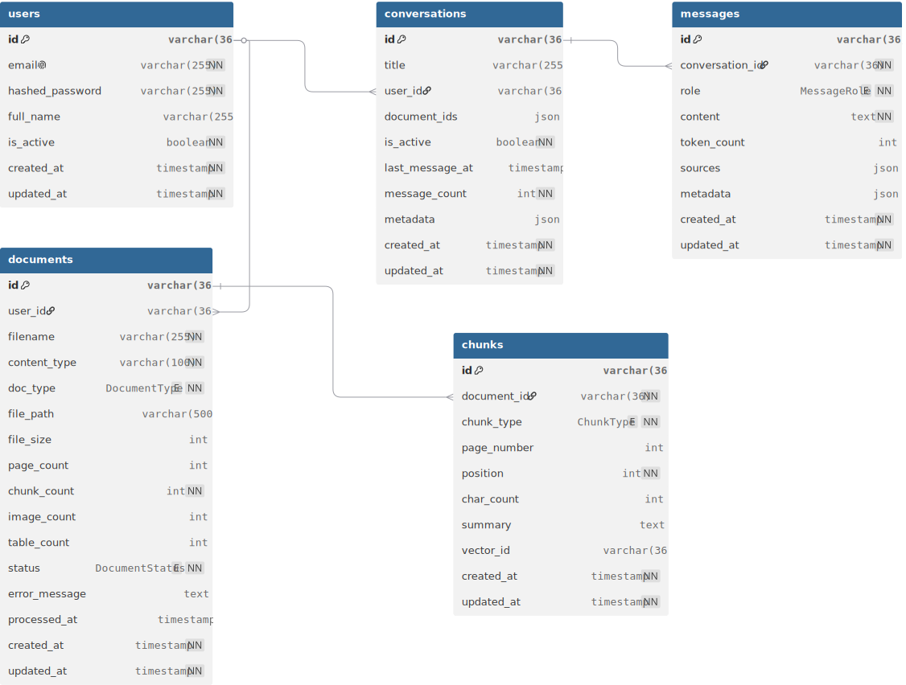

# 🚀 RAGForge

**A Multimodal RAG Pipeline**

[](https://github.com/your-org/ragforge)
[](https://www.python.org/)
[](https://fastapi.tiangolo.com/)
[](https://www.langchain.com/)
[](https://github.com/astral-sh/uv)

RAGForge is a full‑stack document intelligence platform that ingests, processes, and queries complex multimodal documents—**text, tables, and images**—using a highly modular architecture. It combines state‑of‑the‑art parsing, hybrid vector+docstore retrieval, and streaming LLM generation into a cohesive API‑first system.

---

## ✨ Core Capabilities

- 🧠 **Multimodal Ingestion** – Handles PDFs, Word, Excel, PowerPoint, Markdown, HTML, and image extraction via `unstructured`.
- 🔄 **Hierarchical Element Processing** – Splits documents into semantic chunks (text, tables, images), generates search‑optimised summaries, and preserves original content for fidelity.
- 🖼️ **Vision‑Native** – Uses a dedicated vision model (e.g., `qwen3-vl`) to summarise images with objective descriptions, storing base64 payloads for frontend rendering.
- ⚡ **Real‑Time Streaming** – Server‑Sent Events (SSE) deliver token‑by‑token responses, with support for reasoning/thinking tokens and automatic Mermaid diagram sanitisation.
- 🔐 **Multi‑Tenant Isolation** – Full JWT authentication and per‑user document/conversation filtering ensures strict data privacy.
- 💾 **Hybrid Storage** – ChromaDB for vector embeddings, SQL (SQLite/PostgreSQL) for metadata, and a local DocStore for original chunk content.
- 🧩 **LangChain‑Native** – Built with LCEL (LangChain Expression Language) for flexible, observable pipelines.

---

## 🏗️ Architecture Overview (Ingestion → Retrieval → Generation)

The system is composed of two main pipelines:



---

## 🗄️ Database Schema

The relational models (SQLAlchemy) use **UUID primary keys**, automatic timestamps, and soft‑delete support. The schema below is extracted directly from the codebase.



**Key points:**

- The `vector_id` in `chunks` links to the embedding in ChromaDB.
- Original chunk content is stored in a separate **DocStore** (SQLite flat table) to keep the SQL DB lightweight.
- `conversations` store a JSON list of `document_ids` to scope the context per chat.

---

## 🛠️ Technology Stack

| Layer                | Tools                                         |
| :------------------- | :-------------------------------------------- |
| **API Framework**    | FastAPI (async, OpenAPI, SSE)                 |
| **ORM & Database**   | SQLAlchemy (SQLite/PostgreSQL)                |
| **Vector Store**     | ChromaDB (via LangChain)                      |
| **LLM Backend**      | Ollama (pluggable; can swap for OpenAI, etc.) |
| **Embeddings**       | Sentence‑Transformers (`all‑MiniLM‑L6‑v2`)    |
| **Document Parsing** | Unstructured (`hi_res` strategy)              |
| **Orchestration**    | LangChain (LCEL, batch, streaming)            |
| **Authentication**   | JWT (HS256) with bcrypt password hashing      |
| **Testing**          | PyTest with isolated database fixtures        |

---

## 🚀 Getting Started

### Prerequisites

- Python 3.12+
- [Ollama](https://ollama.com/) (or any other LLM provider you wish to use—simply adjust the config)
- Recommended: pull a text model and a vision model:
  ```bash
  ollama pull llama3.2:3b
  ollama pull qwen3-vl:4b
  ```

### Installation with `uv` (Recommended)

```bash
git clone https://github.com/your-org/ragforge.git
cd ragforge
uv sync
```

### Configuration

Create a `.env` file in the project root. At a minimum, set:

```env
SECRET_KEY=your-strong-secret-key
DATABASE_URL=sqlite:///./ragforge.db   # or postgresql://...
```

All other settings (Ollama host, model names, upload limits, CORS, etc.) can be overridden via environment variables or by editing `src/ragforge/config/environment.py`—the system is fully configurable through Pydantic settings.

### Run the Server

```bash
export PYTHONPATH="${PYTHONPATH}:$(pwd)/src"
uv run fastapi dev src/ragforge/main.py
```

Then visit:

- API root: `http://127.0.0.1:8000/`
- Interactive Swagger UI: `http://127.0.0.1:8000/docs`

---

## 📚 API Endpoints Summary

| Method   | Endpoint                   | Description                       |
| :------- | :------------------------- | :-------------------------------- |
| `POST`   | `/auth/register`           | Create user                       |
| `POST`   | `/auth/login`              | Get JWT token (OAuth2 form)       |
| `GET`    | `/auth/me`                 | Current user profile              |
| `POST`   | `/files/upload`            | Single file upload                |
| `POST`   | `/files/upload/multiple`   | Batch upload                      |
| `POST`   | `/files/process/{file_id}` | Start ingestion pipeline (async)  |
| `GET`    | `/files/status/{file_id}`  | Poll processing status            |
| `GET`    | `/files`                   | List user’s documents (paginated) |
| `POST`   | `/conversations`           | Create chat session               |
| `GET`    | `/conversations`           | List conversations                |
| `POST`   | `/conversations/{id}/ask`  | **Streaming** Q&A (SSE)           |
| `DELETE` | `/conversations/{id}`      | Soft‑delete                       |

> The `/docs` endpoint provides a full interactive API explorer.

---

## 🔄 Ingestion Pipeline (Deep Dive)

1. **Partitioning**: `unstructured` extracts elements using `hi_res` strategy.
2. **Classification**: Each element is typed as text (`CompositeElement`), table (`Table`/`TableChunk`), or image.
3. **Summarisation** (batched with LangChain):
   - **Text** → summarised by the text LLM.
   - **Tables** → converted to HTML, then summarised.
   - **Images** → base64 payload sent to vision model for objective description.
4. **Storage**:
   - Summaries → ChromaDB (vectors).
   - Original content → local DocStore.
   - Metadata (chunk counts, image/table counts, status) → SQL DB.

---

## 💬 Query & Streaming Flow

When a user asks a question in a conversation:

- The **Multi‑Vector Retriever** (with `mmr` search) fetches relevant summaries from ChromaDB, filtered by `user_id` and optional `document_ids`.
- **Resolve Originals** replaces each summary with the full raw content from the DocStore.
- **Prompt Builder** constructs the final prompt using:
  - The resolved context (respecting `MAX_CONTEXT_TOKENS`)
  - Recent chat history (`MAX_HISTORY_EXCHANGES`)
  - The `RAG_SYSTEM_PROMPT` (enforces citations, formatting, Mermaid detection)
- The LLM generates a response, streamed token‑by‑token over SSE.
- The assistant’s final answer, along with source citations, is saved to the database.

---

## 🧪 Testing

Run the full suite with:

```bash
uv run pytest tests/ -v
```

Tests include unit tests for services, database model integrity, route integration, and special utilities like Mermaid sanitisation and SSE formatting.

---

## ⚠️ Known Limitations (Active Development)

- **LLM Bottleneck**: The summarisation pipeline runs in-process with FastAPI `BackgroundTasks`. For large documents, this can block the main thread. A proper async worker queue (Celery, etc.) is planned.
- **Concurrency**: Default `max_concurrency=1` for LLM batches; can be increased but may strain local resources.
- **No Distributed Scaling**: Currently single‑node; future work includes horizontal scaling and pgvector support.

---

## 🗺️ Roadmap

- [ ] Replace `BackgroundTasks` with Celery + Redis for robust queueing.
- [ ] Support pgvector for PostgreSQL‑native vector search.
- [ ] Add WebSocket streaming for real‑time collaboration.
- [ ] Improve image handling with thumbnail extraction and CDN.

---

---

**Happy building!** 🚀
